<div align="center">

<!-- ANIMATED HEADER — capsule-render waving, exact palette tokens -->
<h3><code>tmiftah@github ~ $ whoami</code></h3>

<table>
<tr>
<td valign="top"></td>
</tr>
</table>

<br>

<!-- ANIMATED TYPING — Space Mono to match accent-pixel font role -->
<a href="https://tmiftah.vercel.app">
  
</a>

<br/>

<!-- STATUS ROW — exact bg #202526, border #e5e7eb, accent #80ee63 -->
[](https://www.upwork.com/freelancers/~01ace41250db12e212)
[](https://tmiftah.vercel.app)

</div>

---

## `> SKILL_MATRIX`

<div align="left">


</div>

---

## `> CONTRIBUTION_MATRIX`

<div align="center">


</div>

---

---

## `> EXPERIENCE_LOG`

```
[2024] ─── NexMobility ────────────────────── INTERN / Full-Stack Engineer
           └── React · Django · REST APIs · System integrations

[2022] ─── OCP Group ──────────────────────── INTERN / Software Developer
           └── Internal tooling · Data pipelines · Python

[ONGOING] ── 42 Network ───────────────────── STUDENT / Systems & Algorithms
              └── C · Linux · VXLAN · Docker · K8s · Network emulation (GNS3)
```

---

## `> CONNECT`

<div align="center">

[](https://tmiftah.vercel.app)
[](https://linkedin.com/in/tmiftah)
[](https://www.upwork.com/freelancers/~tmiftah)

</div>
